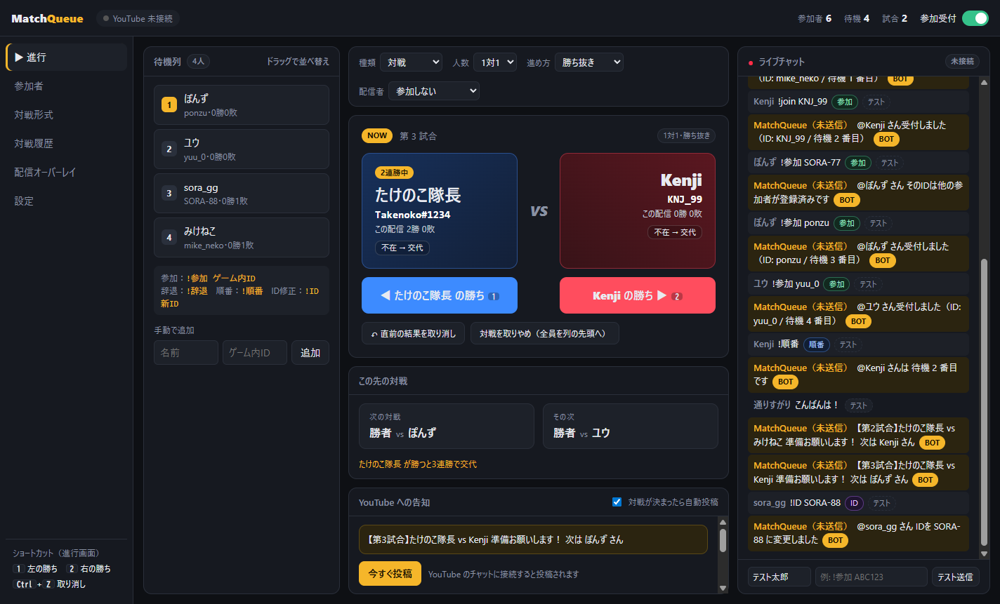
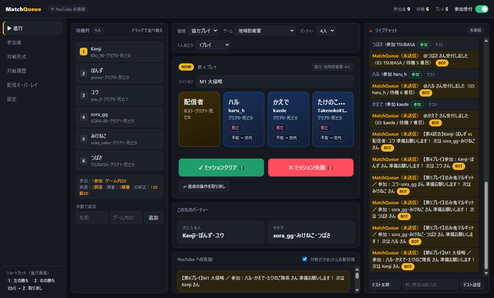
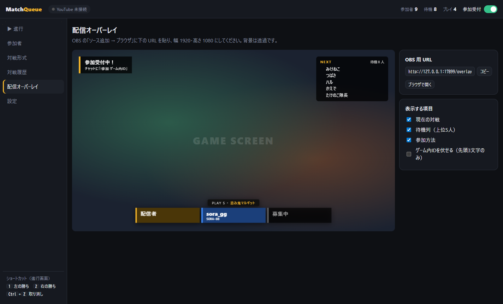

# MatchQueue

YouTube のゲーム配信で行う **視聴者参加型のルームマッチ・協力プレイ** の順番待ちと進行を管理する Windows アプリです。

視聴者がチャットに `!参加 ゲーム内ID` と書くと待機列に入り、次の対戦・パーティーを自動で組みます。
配信者は勝敗（クリア / 全滅）をボタン 1 つで入力するだけで、次の組み合わせがアプリ・配信画面（OBS）・YouTube チャットに告知されます。

<p align="center">
  <a href="https://github.com/kijitora-no-hito/matchqueue/releases/latest/download/MatchQueue-Setup.exe">
    
  </a>
  <br>
  <sub>ボタンを押すとインストーラ（MatchQueue-Setup.exe）がダウンロードされます。使い方は下の「<a href="#インストール">インストール</a>」を見てください。</sub>
</p>



## できること

- **チャットで参加受付**：`!参加 ID` / `!辞退` / `!順番` / `!ID 新ID`（全角の「！」でも OK）
- **対戦**：1対1・2対2、勝ち抜き（連勝上限あり）・ローテーション
  - 配信者の参加方法を切り替え可能：参加しない / 毎試合出る / 列に並ぶ / 勝ち抜きの王者役
- **協力プレイ**：配信者のパーティー（3〜4人）に視聴者が入る
  - エルデンリング・ダークソウル（ボス撃破 / 全滅）、地球防衛軍（ミッションクリア / 失敗）の言い回しに対応
  - ゲストが死亡したらその人だけ交代。ボス名・ミッション名の記録
- **OBS オーバーレイ**：ブラウザソースに URL を貼るだけで対戦カード・パーティー・待機列・受付の返信を表示（背景透過）
- **チャットの読み取り**：[わんコメ](https://onecomme.com/) 連携（設定かんたん）または YouTube Data API（上級者向け）
- **YouTube チャットへの自動告知**（YouTube Data API 利用時のみ）
- 取り消し（Ctrl+Z）、不在の人の交代、待機列のドラッグ並べ替え、履歴の CSV 出力





## インストール

1. **[インストーラをダウンロード](https://github.com/kijitora-no-hito/matchqueue/releases/latest/download/MatchQueue-Setup.exe)**（常に最新版です）して実行
   - 署名していないため「Windows によって PC が保護されました」と出ます。「詳細情報」→「実行」で進めてください
   - ブラウザで「一般的にダウンロードされていません」と出た場合は、「…」→「保持する」を選んでください
2. スタートメニューまたはデスクトップの「MatchQueue」から起動

過去のバージョンや更新内容は [Releases](../../releases) にあります。

データ（参加者・履歴・設定）は `%APPDATA%\MatchQueue` に保存されます。上書きインストールしても消えません。

## 使い方

チャットの読み取り方法は次の 3 通りから選べます。

| 方法 | 準備 | チャットからの参加受付 | チャットへの自動投稿 |
|---|---|---|---|
| なし | 不要 | ×（手動で追加） | × |
| **わんコメ連携（おすすめ）** | わんコメにプラグインを入れるだけ | ○ | ×（返信はオーバーレイに表示） |
| YouTube Data API | Google Cloud の設定が必要 | ○ | ○ |

### わんコメ連携（おすすめ）

コメントビューア [わんコメ](https://onecomme.com/) が受け取ったコメントを、専用プラグインで MatchQueue に転送します。

1. わんコメをインストールして一度起動しておく
2. MatchQueue の「設定 → わんコメ連携」で **わんコメにプラグインを入れる** を押す
3. わんコメの **プラグイン** 画面（「連携」画面とは別）で **MatchQueue 連携** のスイッチをオンにする（出てこない場合は「再読み込み」かわんコメを再起動）
4. MatchQueue の表示が「わんコメ連携中」になれば準備完了です

わんコメ連携ではチャットに自動投稿できないため、次の 2 つで代わりに知らせます。

- **OBS オーバーレイのお知らせ**：受付の返信（「受付しました」「ID を付けてください」など）を配信画面に表示
- **チャット投稿候補**：告知や返信の文面が進行画面に並ぶので、「コピー」して YouTube のチャットに貼り付け。貼った文面がチャットに流れると候補から自動で消えます。新しい候補が出ると通知音が鳴ります（設定で ON/OFF・音量）

※ プラグインにはわんコメ 5.2 以降が必要です（4.x 以前には プラグイン機能がありません）。

### YouTube Data API（任意・上級者向け）

チャットへの自動告知もしたい場合は、YouTube Data API の設定（Google Cloud プロジェクトの作成）が必要です。
手順は [docs/youtube-setup.md](docs/youtube-setup.md) を参照してください（初回のみ 10 分程度）。

### 連携なしで試す

- 参加者は「手動で追加」から登録できます
- チャット欄の下の「テスト送信」で、コマンドの動きを試せます

### OBS オーバーレイ

「配信オーバーレイ」画面の URL（既定 `http://127.0.0.1:17800/overlay`）を、OBS の「ソース追加 → ブラウザ」に貼り、幅 1920・高さ 1080 にします。

### ショートカット（進行画面）

| キー | 対戦 | 協力プレイ |
|---|---|---|
| `1` | 左の勝ち | ボス撃破 / クリア |
| `2` | 右の勝ち | 全滅 / 失敗 |
| `Ctrl` + `Z` | 取り消し | 取り消し |

## 開発

Node.js 22 以降が必要です。

```powershell
npm install
npm start        # 起動
npm test         # ユニットテスト
npm run smoke    # 自動操作して .smoke/ に各画面のスクリーンショットを保存
npm run dist     # インストーラを dist/ に作成
```

構成は Electron（ランタイム依存なし）。進行ロジックは [src/main/engine.js](src/main/engine.js) にまとまっています。

## ライセンス

[MIT](LICENSE)

わんコメ連携は、[わんコメ](https://onecomme.com/) の公式プラグイン機能を利用しています。わんコメの利用規約に従ってご利用ください。
