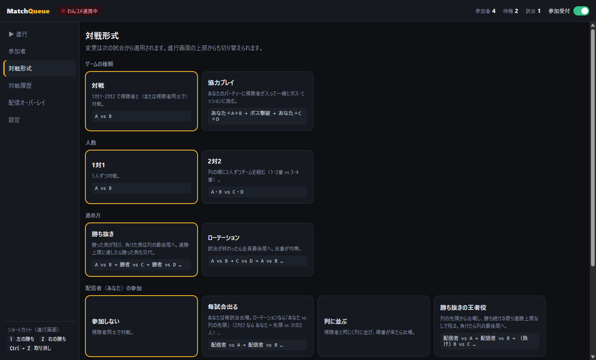
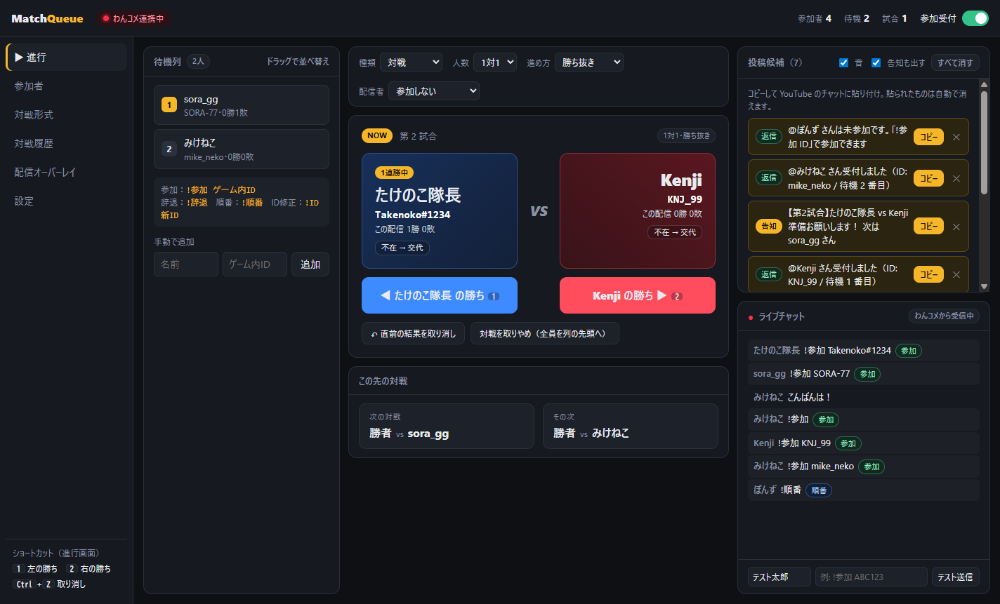
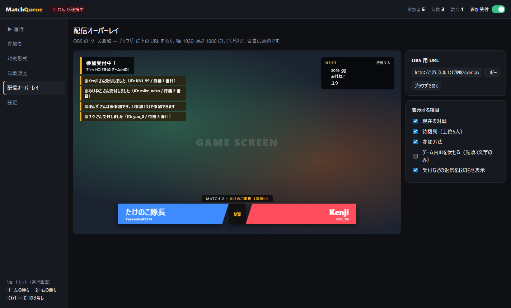
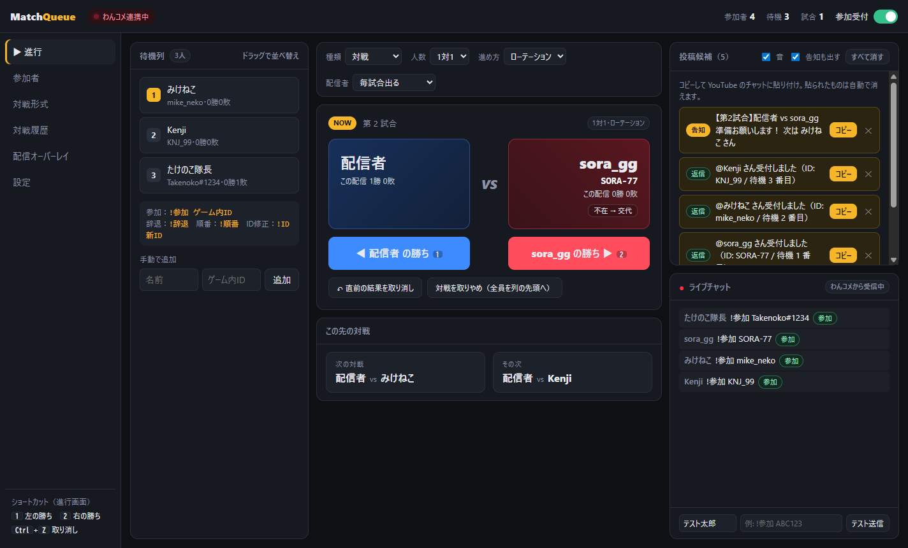
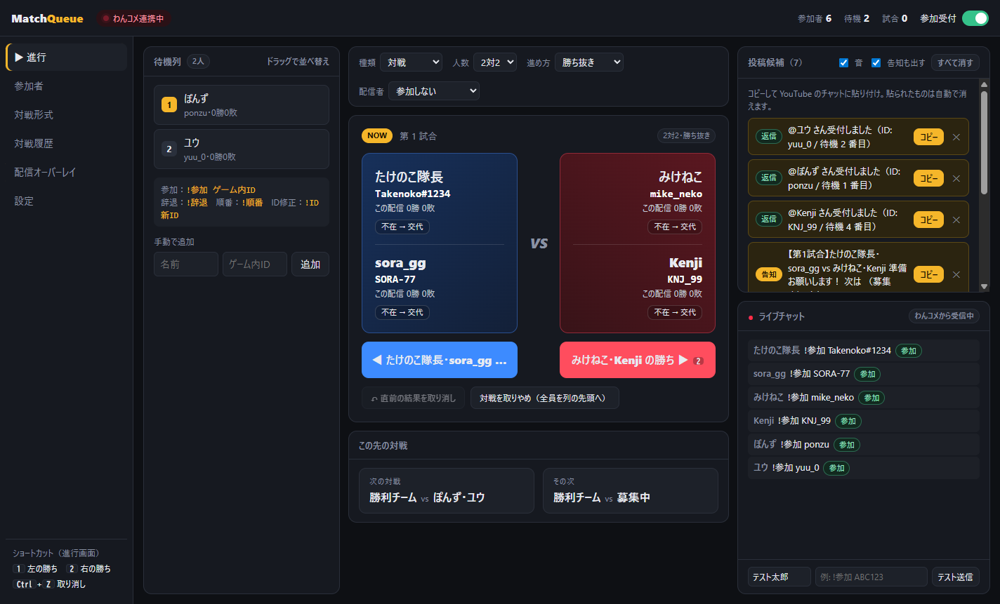
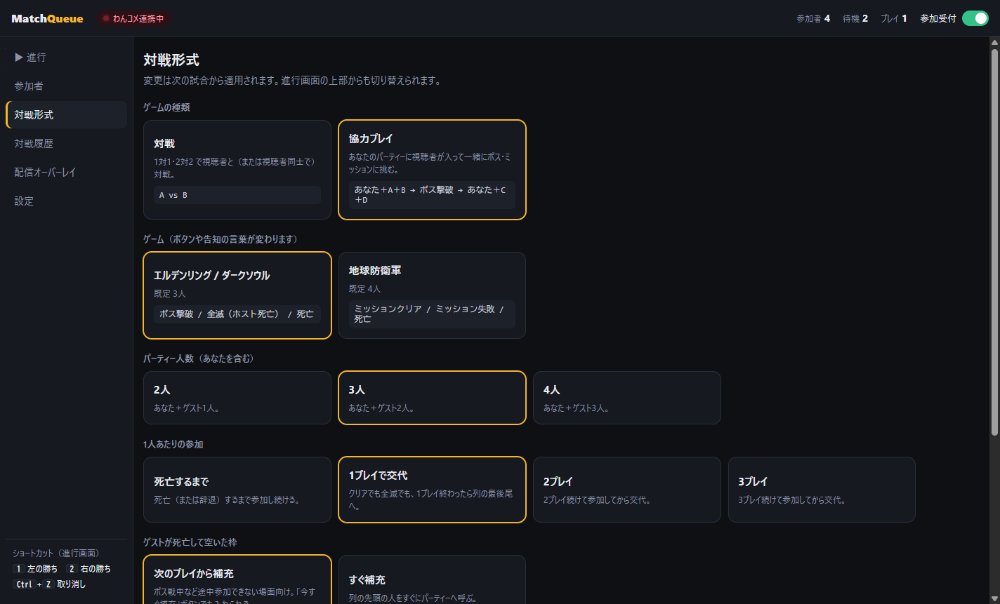
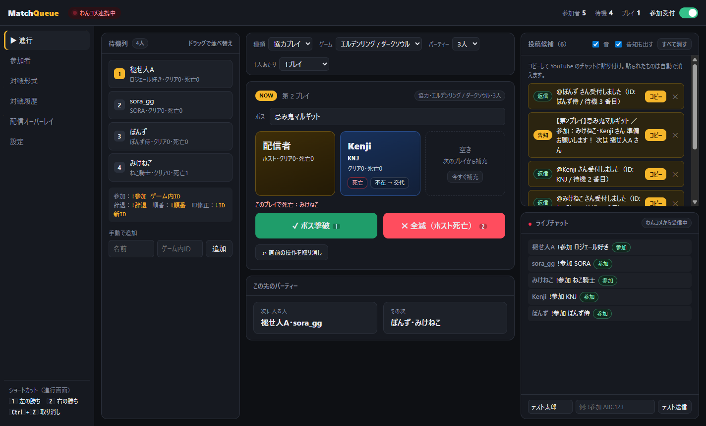
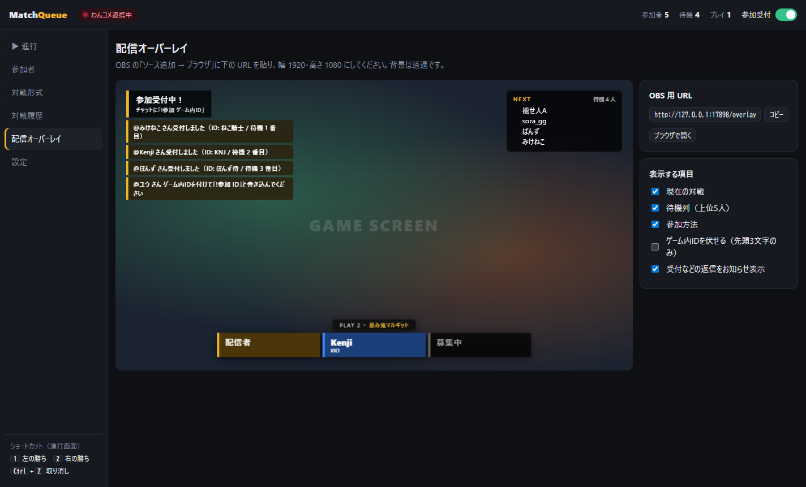
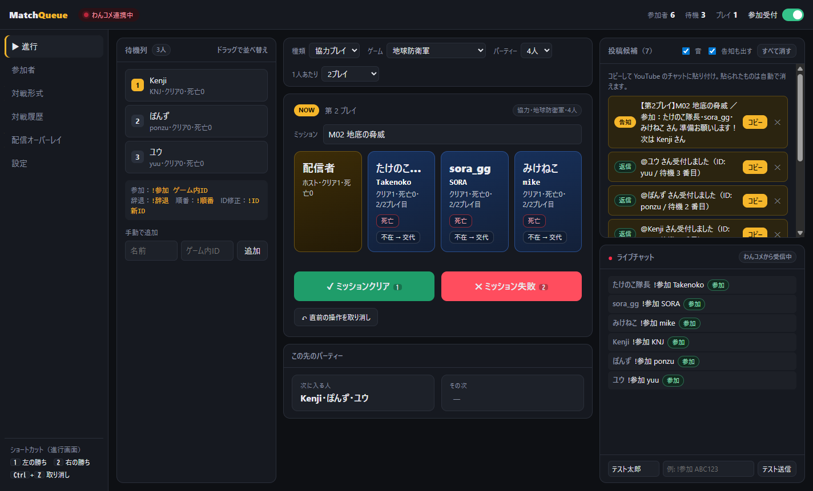
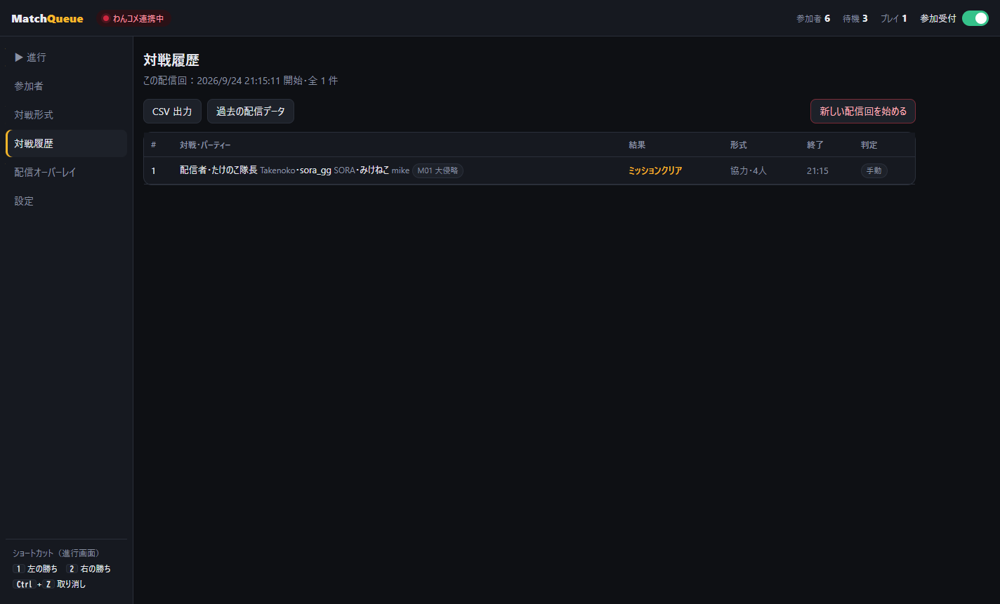

# MatchQueue 使い方ガイド

配信中に MatchQueue をどう使うかを、ゲームの種類ごとに説明します。
インストールやわんコメ・OBS の準備がまだの場合は、先に [README のセットアップ](../README.md#セットアップ初回だけ) を済ませてください。

- [配信 1 回の流れ](#配信-1-回の流れ)
- ゲーム別の設定と進め方
  - [A. 1対1の対戦ゲーム（視聴者同士）](#a-1対1の対戦ゲーム視聴者同士)
  - [B. 視聴者があなたに挑戦する（1対1）](#b-視聴者があなたに挑戦する1対1)
  - [C. 2対2 の対戦ゲーム](#c-2対2-の対戦ゲーム)
  - [D. エルデンリング / ダークソウル（協力プレイ）](#d-エルデンリング--ダークソウル協力プレイ)
  - [E. 地球防衛軍（協力プレイ）](#e-地球防衛軍協力プレイ)
- [配信中の「こんな時は」早見表](#配信中のこんな時は早見表)
- [キーボードショートカット](#キーボードショートカット)
- [視聴者への案内文（コピーして使えます）](#視聴者への案内文コピーして使えます)
- [困ったとき](#困ったとき)

---

## 配信 1 回の流れ

**配信前**

1. わんコメと MatchQueue を起動する（ヘッダーに「わんコメ連携中」と出れば OK）
2. 前回の参加者が残っていたら「対戦履歴 → 新しい配信回を始める」で空にする（前回分は保存されます）
3. 進行画面の上部で、今日のゲームに合わせて **種類・人数・進め方** を選ぶ（下の「ゲーム別」を参照）

**配信開始**

4. 視聴者に参加方法を伝える（[案内文](#視聴者への案内文コピーして使えます) を概要欄や固定コメントに）
5. 視聴者がチャットに `!参加 ゲーム内ID` と書くと、待機列に自動で並びます。人数が揃うと最初の組み合わせが自動で決まります

**配信中（くり返し）**

6. 画面の「NOW」に出ている人と対戦・協力する
7. 終わったら結果のボタン（またはキーボードの `1` / `2`）を押す → 次の組み合わせが自動で決まる
8. 右上の **投稿候補** に告知文が出るので、「コピー」して YouTube のチャットに貼る（音でも知らせます）

**締め**

9. 右上の「参加受付」スイッチをオフにして、待機列に残っている人を消化する
10. 必要なら「対戦履歴 → CSV 出力」で記録を保存

> **投稿候補について**：わんコメ連携ではチャットに自動で書き込めないため、MatchQueue が作った文面（次の対戦の告知、「受付しました」などの返信）を右上に並べます。
> 「コピー」→ YouTube のチャットに貼り付け、で視聴者に伝わります。貼ったものは自動で消えます。
> 受付の返信は OBS のオーバーレイにも表示されるので、全部を貼らなくても大丈夫です。

---

## ゲーム別の設定と進め方

### A. 1対1の対戦ゲーム（視聴者同士）

格闘ゲームや対戦パズルなどで、**視聴者同士を戦わせて配信で見せる** 形です。あなたは進行役に専念します。

**設定（進行画面の上部）**

| 項目 | 設定 |
|---|---|
| 種類 | 対戦 |
| 人数 | 1対1 |
| 進め方 | 勝ち抜き（勝った人が残る）／ローテーション（全員に均等に出番） |
| 配信者 | 参加しない |

「対戦形式」画面では、連勝上限（勝ち抜きで何連勝したら交代させるか）なども決められます。



**配信中の操作**



- 中央の **NOW** が今の対戦です。名前の下の文字（例：`Takenoko#1234`）がゲーム内 ID なので、ゲーム内でこの人を探して部屋に招待します
- 試合が終わったら、勝った側のボタン（キーボードの `1` = 左、`2` = 右）を押します
  - 勝ち抜きなら勝者が残り、次の挑戦者が自動で入ります。負けた人は列の最後尾へ
  - 「○連勝中」のバッジが出て、連勝上限に達すると勝者も交代します
- 呼んでも来ない人は、その人の「不在 → 交代」で列の次の人と入れ替えます
- 押し間違えたら「直前の結果を取り消し」（`Ctrl` + `Z`）
- 左の **待機列** は、ドラッグで順番を入れ替えられます
- 右上の **投稿候補** の告知（例：「【第2試合】たけのこ隊長 vs Kenji 準備お願いします！」）を「コピー」してチャットに貼ると、呼び出しになります

**配信画面（OBS オーバーレイ）**



今の対戦カード・次に待っている人・参加方法が常に表示されます。受付の返信（「受付しました」「ID を付けてください」など）も左上に数秒表示されるので、視聴者は自分が受け付けられたかを配信画面で確認できます。

---

### B. 視聴者があなたに挑戦する（1対1）

**あなた vs 視聴者を 1 人ずつ** 順番に戦う形です。

| 項目 | 設定 |
|---|---|
| 種類 | 対戦 |
| 人数 | 1対1 |
| 進め方 | ローテーション |
| 配信者 | 毎試合出る |



- 左側は常に「配信者（あなた）」、右側に列の先頭の人が入ります
- 勝っても負けても、試合が終わると挑戦者は列の最後尾へ回り、次の人が挑戦します

**ほかの参加のしかた**

- 「配信者」を **勝ち抜きの王者役** にすると、あなたが勝ち続ける限り連勝上限なしで残り、負けたら勝った視聴者が次の王者になります（あなたは列の最後尾へ）
- **列に並ぶ** にすると、あなたも視聴者と同じ順番待ちに入ります（視聴者同士の対戦にときどき混ざる時に）

---

### C. 2対2 の対戦ゲーム

| 項目 | 設定 |
|---|---|
| 種類 | 対戦 |
| 人数 | 2対2 |
| 進め方 | 勝ち抜き／ローテーション |
| 配信者 | 参加しない（あなたも入るなら「毎試合出る」） |



- 列の先頭から順に **1・2 番目 vs 3・4 番目** でチームが組まれます
- 勝ち抜きなら勝ったチームがそのまま残り、次の 2 人が挑戦します
- 「配信者：毎試合出る」にすると、**あなた＋列の先頭 vs 次の 2 人** になります
- 1 人だけ来ない時は、その人の「不在 → 交代」で列の先頭の人が同じチームに入ります

---

### D. エルデンリング / ダークソウル（協力プレイ）

**あなたの世界に視聴者を召喚して一緒にボスを倒す** 形です。

| 項目 | 設定 |
|---|---|
| 種類 | 協力プレイ |
| ゲーム | エルデンリング / ダークソウル |
| パーティー | 3人（あなた＋2人）※ ゲームや遊び方に合わせて 2〜4 人 |
| 1人あたり | 1プレイ（1 回挑戦したら交代） |
| 空いた枠 | 次のプレイから補充（ボス戦の途中では呼べないため） |



> **ゲーム内 ID のおすすめ**：召喚サインで見分けられるよう、**キャラクター名** を `!参加 キャラクター名` で登録してもらうとスムーズです。
> 合言葉を使う場合は、配信の案内で合言葉も伝えておきましょう。

**配信中の操作**



1. 「ボス」欄に挑戦するボス名を入れておく（任意。告知・履歴・オーバーレイに出ます）
2. パーティーのカードに出ている人（キャラクター名）の召喚サインを探して召喚する
3. プレイ中に起きたことをボタンで記録します

| 起きたこと | 押すボタン | どうなるか |
|---|---|---|
| ボスを倒した | **ボス撃破**（`1`） | 全員に「クリア」が記録され、ゲストは列の最後尾へ。次のパーティーが組まれる |
| あなたが倒されて全滅 | **全滅（ホスト死亡）**（`2`） | 全滅として記録。ゲストは交代して次のパーティーへ |
| ゲストが倒れた | その人の **死亡** | その人だけ抜けて列の最後尾へ。枠は「空き」になり、次のプレイで補充 |
| ボス戦の前なので今すぐ呼びたい | 空き枠の **今すぐ補充** | 列の先頭の人がすぐにパーティーに入る |

- 死亡したゲストは、そのプレイの「クリア」には数えられません（参加者画面でクリア・全滅・死亡の回数を確認できます）
- 同じボスに再挑戦する時は、ボス名はそのまま次のプレイに引き継がれます

**配信画面（OBS オーバーレイ）**



パーティーの顔ぶれ・空き枠（募集中）・ボス名が表示されます。

---

### E. 地球防衛軍（協力プレイ）

**オンラインの部屋に視聴者を集めて一緒にミッションに挑む** 形です。

| 項目 | 設定 |
|---|---|
| 種類 | 協力プレイ |
| ゲーム | 地球防衛軍 |
| パーティー | 4人（あなた＋3人） |
| 1人あたり | 2プレイ（2 ミッション続けて遊んでから交代）など、配信のテンポに合わせて |
| 空いた枠 | 次のプレイから補充 |

> **ゲーム内 ID のおすすめ**：部屋で見分けられるよう **プレイヤー名** を登録してもらいます。部屋にパスワードを掛けて、配信の案内で伝えると関係ない人が入りにくくなります。



- 「ミッション」欄にミッション名を入れておきます
- ミッションをクリアしたら **ミッションクリア**（`1`）、失敗したら **ミッション失敗**（`2`）
- 「1人あたり 2プレイ」の時は、カードに「1/2プレイ目」「2/2プレイ目」と出ます。2 プレイ遊んだ人から順に交代します
- 途中で抜けた人は「不在 → 交代」、倒れて抜けた人は「死亡」

**記録**



「対戦履歴」画面に、プレイごとの参加者・結果・ボス名/ミッション名・死亡した人が残ります。CSV で書き出せます。

---

## 配信中の「こんな時は」早見表

| こんな時は | 操作 |
|---|---|
| 結果ボタンを押し間違えた | 「直前の結果を取り消し」または `Ctrl` + `Z`（何回でも戻せます） |
| 呼んだ人が来ない・回線落ちした | その人のカードの「不在 → 交代」（その人は保留になり、あとで「参加者」画面から列に戻せます） |
| 順番を入れ替えたい | 待機列をドラッグ。「参加者」画面の「先頭へ」も使えます |
| 視聴者が ID を間違えた | 視聴者に `!ID 正しいID` と書いてもらう。または「参加者」画面で ID をクリックして直す |
| チャットできない人（身内など）を入れたい | 待機列の下の「手動で追加」に名前と ID を入れる |
| 参加を締め切りたい | 右上の「参加受付」をオフ（チャットで参加しようとした人には「締め切り」と返信されます） |
| 途中でゲームや形式を変えたい | 進行画面の上部で切り替え（次の試合・プレイから反映） |
| 投稿候補がたまりすぎた | 不要なものは ✕、まとめて消すなら「すべて消す」 |
| 通知音がうるさい | 投稿候補の「音」のチェックを外す（音量は「設定」画面で調整） |

## キーボードショートカット

進行画面で使えます（文字入力欄にカーソルがある時は無効）。

| キー | 対戦 | 協力プレイ |
|---|---|---|
| `1` | 左の勝ち | ボス撃破 / ミッションクリア |
| `2` | 右の勝ち | 全滅 / ミッション失敗 |
| `Ctrl` + `Z` | 取り消し | 取り消し |

---

## 視聴者への案内文（コピーして使えます）

概要欄や固定コメントに貼って使ってください。`〇〇` の部分はゲームに合わせて書き換えてください。

**対戦ゲーム**

```
【参加方法】
チャットに「!参加 ゲーム内ID」と書き込んでください（例：!参加 ABC123）
・順番はチャットの「!順番」で確認できます
・抜けるときは「!辞退」
・IDを間違えたら「!ID 正しいID」
呼ばれたら〇〇（ルーム名・パスワード）の部屋に入ってください！
```

**エルデンリング / ダークソウル**

```
【協力参加の方法】
チャットに「!参加 キャラクター名」と書き込んでください（例：!参加 褪せ人A）
合言葉：〇〇〇〇
名前を呼ばれたら召喚サインを出してください！
・順番は「!順番」、抜けるときは「!辞退」
・倒れてしまったら列の最後に戻ります。また呼ぶので待っていてください
```

**地球防衛軍**

```
【参加方法】
チャットに「!参加 プレイヤー名」と書き込んでください（例：!参加 ストーム1）
ルーム名：〇〇〇〇 ／ パスワード：〇〇〇〇
名前を呼ばれたらルームに入ってください！（1人〇ミッションずつ交代です）
・順番は「!順番」、抜けるときは「!辞退」
```

---

## 困ったとき

**チャットで「!参加」しても待機列に入らない**

- ヘッダーが「わんコメ連携中」になっているか確認してください（「設定 → わんコメ連携」で状態を確認できます）
- `!参加` と ID の間にスペースが必要です（全角スペース・全角の「！」でも大丈夫です）
- ID なしの `!参加` は受け付けません（2 回目以降の参加は、前回の ID が使われるので `!参加` だけで OK）
- 右上の「参加受付」がオフになっていないか確認してください

**配信画面にオーバーレイが出ない**

- OBS のブラウザソースの URL が「配信オーバーレイ」画面の URL と同じか確認してください
- MatchQueue を起動していないと表示されません

**貼り付けたのに投稿候補から消えない**

- YouTube 側で文面が少し変わると一致しないことがあります。✕ で手動で消してください

その他の不具合や要望は [Issues](https://github.com/kijitora-no-hito/matchqueue/issues) からお知らせください。
